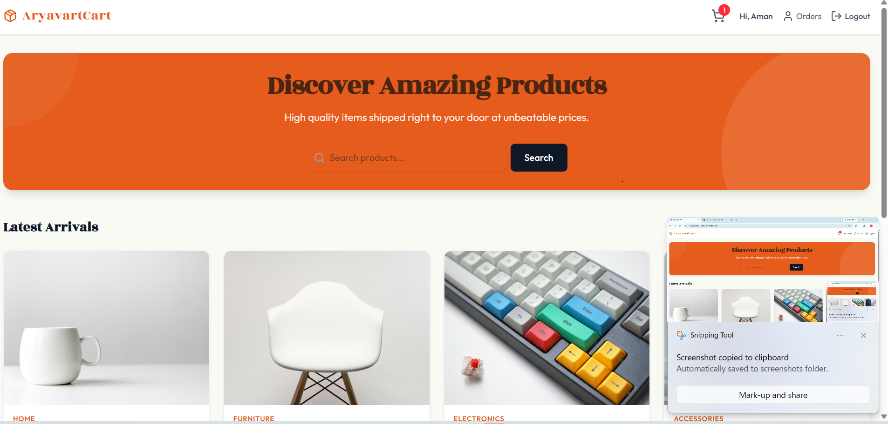
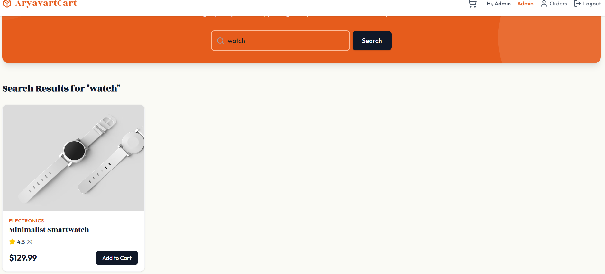
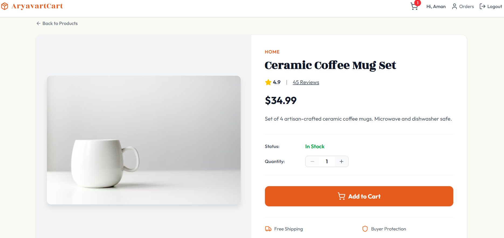
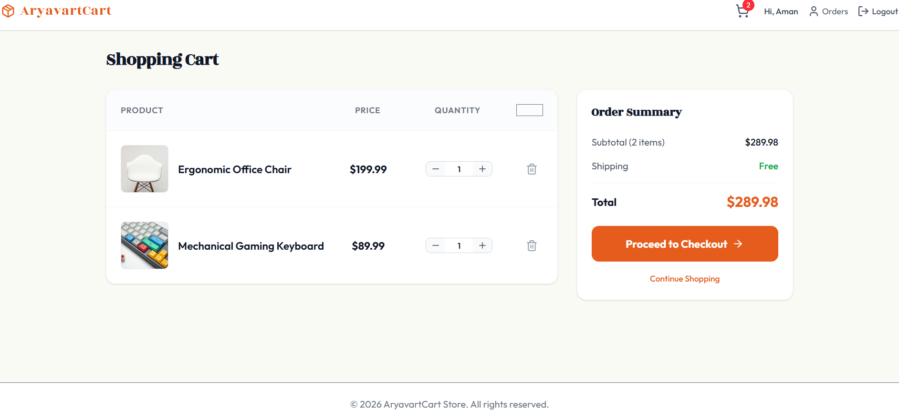
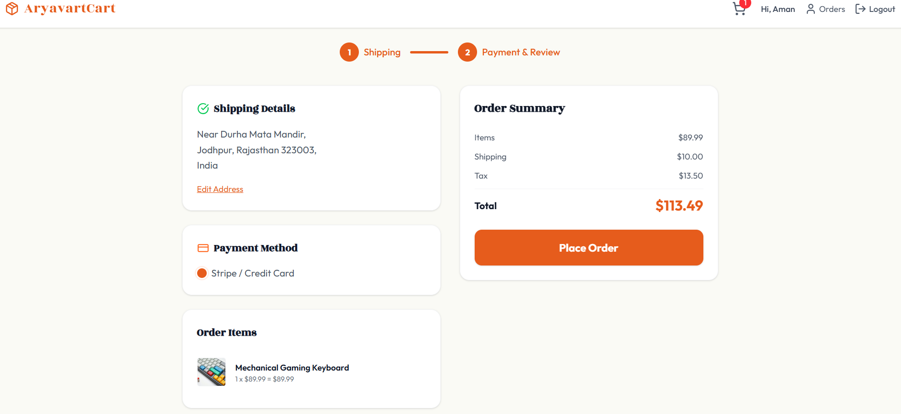
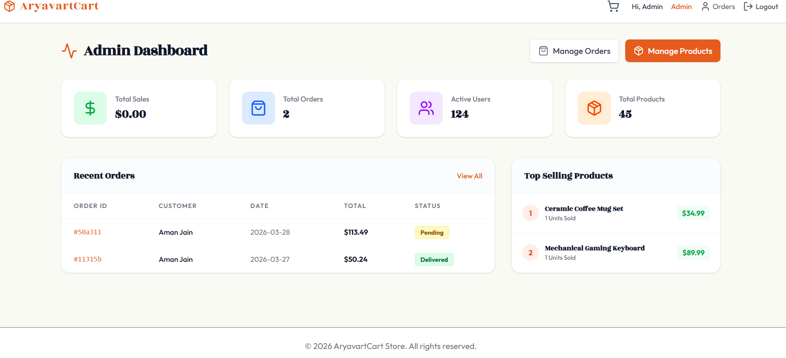
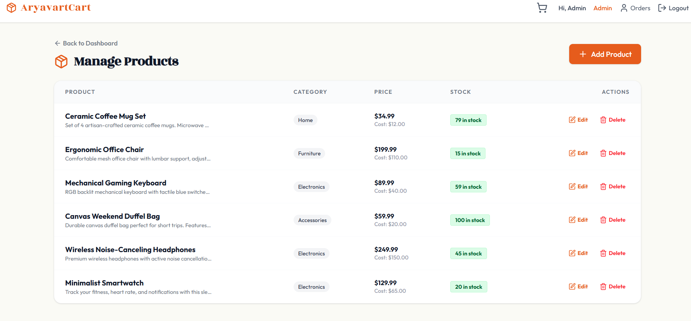
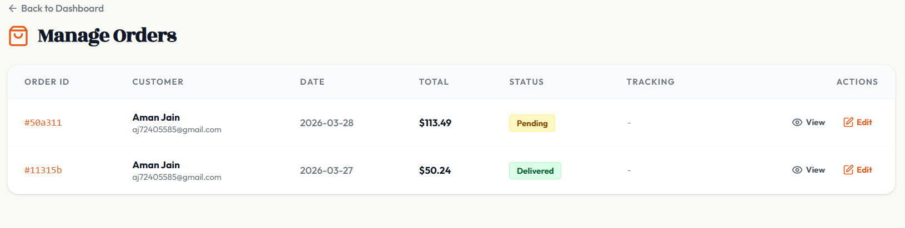

# AryavartCart

[](https://opensource.org/licenses/MIT)
[](https://nodejs.org/)
[](https://reactjs.org/)
[](https://www.mongodb.com/)

AryavartCart is a modern, full-stack dropshipping e-commerce platform built on the MERN stack. Designed with a rich, traditional Indian aesthetic featuring warm saffron and terracotta colors, AryavartCart delivers a premium shopping experience with a seamless frontend and robust backend management.

## Table of Contents

- [Features](#features)
- [Technology Stack](#technology-stack)
- [Prerequisites](#prerequisites)
- [Installation](#installation)
- [Environment Setup](#environment-setup)
- [Running the Application](#running-the-application)
- [Screenshots](#screenshots)
- [Admin Access](#admin-access)
- [Contributing](#contributing)
- [License](#license)

## Features

### Customer Features
- **Modern Traditional UI**: A beautiful, responsive design blending traditional Indian aesthetics with modern web design principles using Tailwind CSS.
- **Product Browsing & Purchasing**: Comprehensive product catalogs, individual product pages, shopping cart, and seamless checkout.
- **Secure Authentication**: User registration and login powered by JSON Web Tokens (JWT).
- **Secure Payments**: Fully integrated Stripe checkout for processing credit cards securely.
- **Order Tracking**: Customers can view their personal order history and current statuses.

### Administrator Features
- **Admin Dashboard**: A centralized hub to view store statistics, recent orders, and top products.
- **Product Management**: Full CRUD capabilities for the store's inventory. Add new items, update pricing and details, and securely manage stock.
- **Image Uploads**: Direct local image uploading capabilities with live thumbnail previews powered by Multer.
- **Automated Stock Management**: Product quantities represent real-world physical stock, automatically decrementing upon successful user checkout to prevent overselling.
- **Order Management**: A comprehensive detailed view of all store transactions including customer credentials, shipping coordinates, and line-item financial breakdowns.
- **Order Lifecycle**: Editable order statuses (`Pending`, `Processing`, `Shipped`, `Delivered`, `Cancelled`) complete with Tracking Number support.

## Technology Stack

- **Frontend**: React (Vite), React Router DOM, Redux Toolkit, Tailwind CSS, Lucide React
- **Backend**: Node.js, Express.js
- **Database**: MongoDB (Mongoose ORM)
- **Authentication**: JSON Web Tokens (JWT) & bcryptjs
- **Payment Processing**: Stripe API
- **File Management**: Multer (Local disk storage)
- **Email Service**: Nodemailer for order confirmations

## Prerequisites

Before running this application, make sure you have the following installed on your machine:

- [Node.js](https://nodejs.org/) (version 18 or higher)
- [MongoDB](https://www.mongodb.com/) (local installation or cloud instance)
- [Git](https://git-scm.com/) (for cloning the repository)

## Installation

1. **Clone the Repository**
   ```bash
   git clone https://github.com/your-username/aryavartCart.git
   cd aryavartCart
   ```

2. **Install Backend Dependencies**
   ```bash
   cd backend
   npm install
   ```

3. **Install Frontend Dependencies**
   ```bash
   cd ../frontend
   npm install
   ```

## Environment Setup

Create a `.env` file in the `backend/` directory based on the following structure:

```env
PORT=3000
MONGO_URI=mongodb://127.0.0.1:27017/dropship
JWT_SECRET=your_jwt_secret_key_here

STRIPE_SECRET_KEY=your_stripe_secret_key_here
STRIPE_WEBHOOK_SECRET=your_stripe_webhook_secret_here

# Email setup for confirmations
EMAIL_HOST=smtp.gmail.com
EMAIL_PORT=587
EMAIL_USER=your_email@gmail.com
EMAIL_PASS=your_email_app_password_here
```

> **Security Note**: Never commit your `.env` file to version control. Add it to your `.gitignore`.

> **Note**: For local image uploads to work out of the box, `multer` expects a `backend/uploads` directory. The upload route automatically handles directory creation if it doesn't exist.

## Running the Application

1. **Start MongoDB**
   Make sure MongoDB is running on your system.

2. **Start the Backend Server**
   ```bash
   cd backend
   npm run dev
   ```
   The server will start on `http://localhost:3000`.

3. **Start the Frontend Application**
   In a new terminal window:
   ```bash
   cd frontend
   npm run dev
   ```
   The application will start on `http://localhost:5173`.

4. **Access the Application**
   - Frontend: [http://localhost:5173](http://localhost:5173)
   - Backend API: [http://localhost:3000](http://localhost:3000)

## Screenshots

### Home Page

*The main landing page showcasing featured products with traditional Indian design elements.*

### Product Catalog

*Browse through the complete product catalog with search and filter options.*

### Product Details

*Detailed product view with images, description, pricing, and add to cart functionality.*

### Shopping Cart

*View and manage items in your shopping cart before checkout.*

### Checkout Process

*Secure checkout page with Stripe payment integration.*

### Admin Dashboard

*Administrator overview with key metrics and recent activity.*

### Product Management

*Admin interface for managing product inventory, prices, and stock levels.*

### Order Management

*Comprehensive order tracking and management system for administrators.*

## Admin Access

To access the Admin features:

1. Register a new user account through the frontend UI.
2. Directly modify your user record in the connected MongoDB database, changing the `role` field from `"user"` to `"admin"`.
3. Log in with the updated account to reveal the Admin Dashboard routing.

Alternatively, you can use MongoDB Compass or the MongoDB shell to update the user role:

```javascript
db.users.updateOne(
  { email: "your-admin-email@example.com" },
  { $set: { role: "admin" } }
)
```

## Contributing

We welcome contributions to AryavartCart! Please follow these steps:

1. Fork the repository
2. Create a feature branch (`git checkout -b feature/AmazingFeature`)
3. Commit your changes (`git commit -m 'Add some AmazingFeature'`)
4. Push to the branch (`git push origin feature/AmazingFeature`)
5. Open a Pull Request

### Development Guidelines

- Follow the existing code style and structure
- Write clear, concise commit messages
- Test your changes thoroughly
- Update documentation as needed

## License

This project is licensed under the MIT License - see the [LICENSE](LICENSE) file for details.

## Support

If you have any questions or need help, please open an issue on GitHub or contact the development team.

---

**AryavartCart** - Bringing traditional Indian craftsmanship to the digital marketplace.
